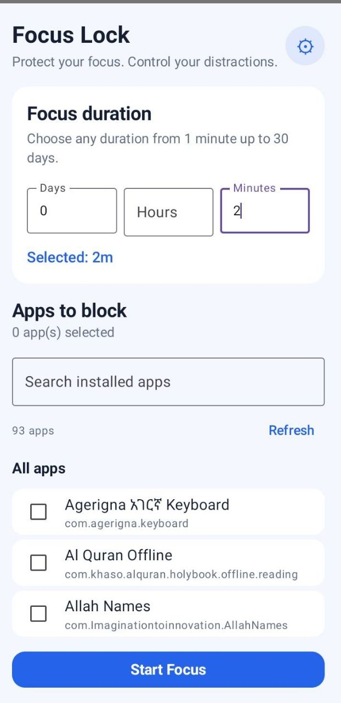
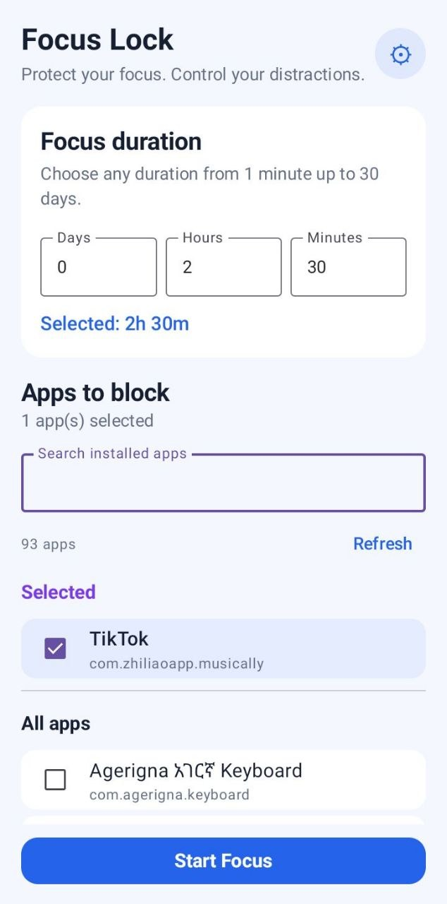
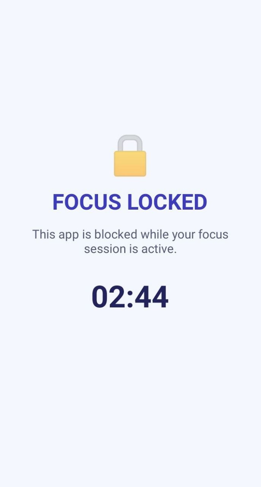
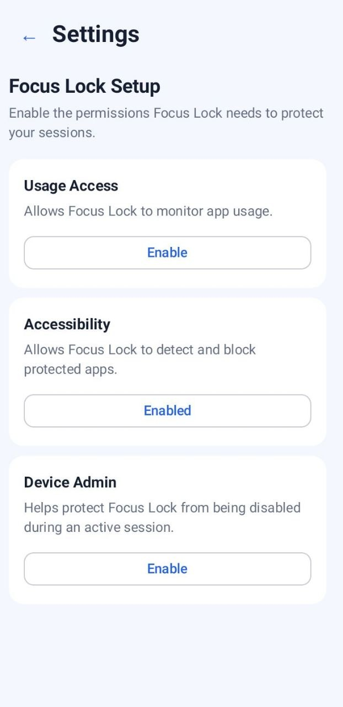

# Focus Lock

Focus Lock is an Android productivity app designed to help users stay focused by restricting access to distracting apps during a timed focus session.

## Features

- ⏱️ Timed focus sessions
- 🚫 Selected-app blocking
- 🆘 Emergency access during an active session
- 🔒 Persistent active sessions
- ♿ Accessibility Service protection
- 🛡️ Device Admin protection
- 🔄 Protection against common bypass attempts
- 📱 Tested on a physical Android device

## Technologies

- Kotlin
- Android Studio
- Android SDK
- Accessibility Service
- Device Administration APIs
- Git & GitHub

## Why I Built It

I built Focus Lock as a practical project to solve a real productivity problem: staying focused when distracting apps are easily accessible.

The project also helped me practice Android development, application security concepts, background services, state management, and debugging.

## Project Status

🚧 **Active project**

The core Focus Lock functionality is working. Future improvements will focus on UI/UX, reliability, and additional productivity features.

## What I Learned

Building Focus Lock gave me hands-on experience with:

- Android application development
- Kotlin
- Android lifecycle and activity management
- Accessibility Services
- Device Administration
- Persistent application state
- Debugging Android applications
- Testing on a physical Android device
- Git and GitHub

## Author

**Omer**

Information Systems Student | Aspiring Full-Stack Developer
## Screenshots

### Home Screen

### App Selection

### Focus Session

### Settings

### Settings

